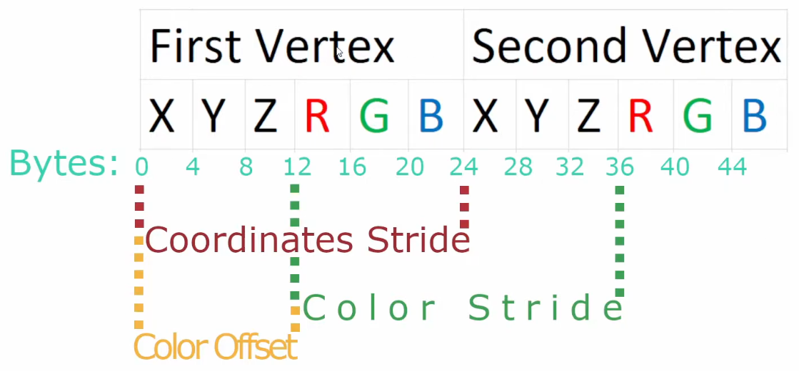
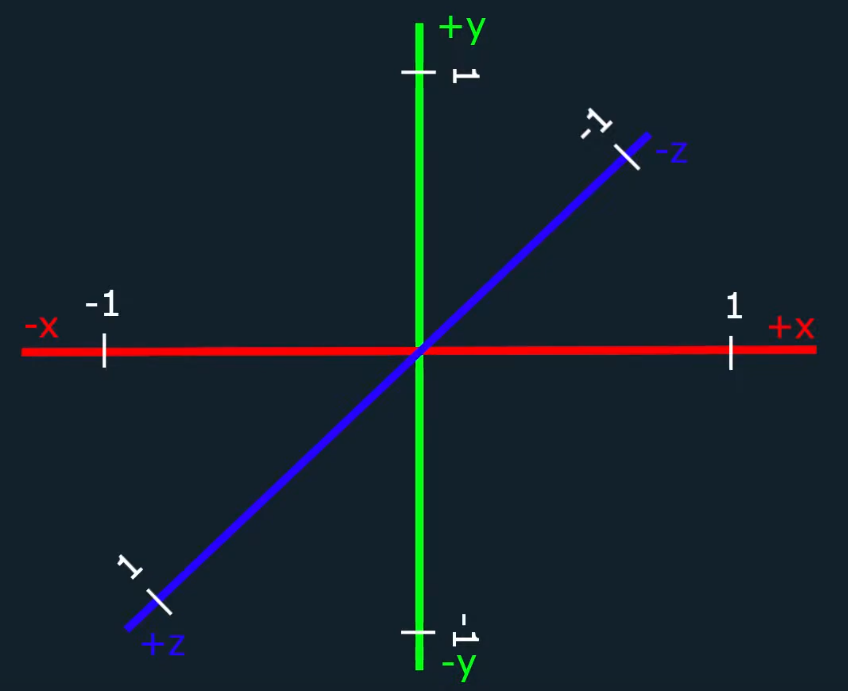
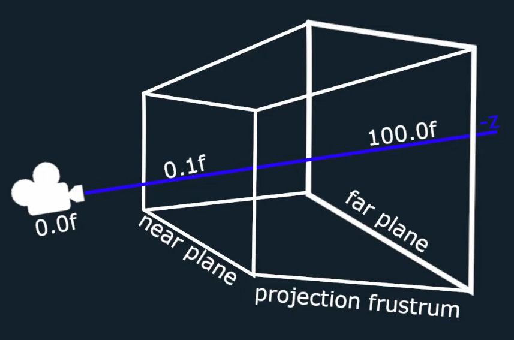
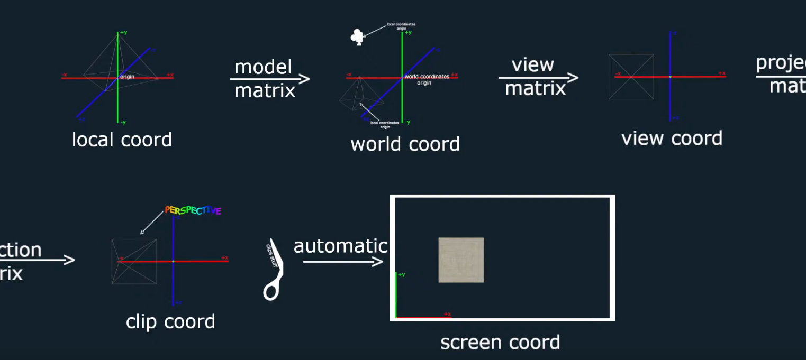

# Notes on Graphics Programming using OpenGL

# Graphics pipeline

1. vertex data 
2. vertex shader 
3. shape assembly
4. geometry shader
5. rasterization 
6. fragment shader 
7. tests and blending

### 1. Vertex Data[] 
- the input data describing the models shape
- array of vertices
- each vertex specifies a point the affine space and some additional data
- one vertex is a vector of $n$ elements:
$$
    \textbf{v} = (v_1, v_2, v_3, \dots, v_n)
$$
 
### 2. Vertex Shader
- takes the position of the vertices and transforms them
- the vector $\textbf{v}$ is multiplied by matrix $A_{n \times n}$
and vector $\textbf{b}$ is added

$$
    \textbf{y} = \textbf{v} A + \textbf{b}
$$

### 3. Shape Assembly
- the shape assembler takes all the transformed positions
and connects them according to a primitive
- primitive could be a polygon (triangle), line, point

### 4. Geometry Shader
- can add vertices and create new primitives out of already existing primitives

### 5. Rasterization
- all the mathematical shapes are discretisized to pixels
- perfect triangle becomes bunch of pixels (squares)

### 6. Fragment Shader
- adds color to the pixels
- depends on lighting, textures, uv maps, shadows, ...

### 7. Tests and Blending
- resolves overlapping of objects
- multiple colors from the fragment shader of multiple objects 
get mapped to one pixel
- this stage decides which color the pixel will take on
- depends on transparency of the objects
 
---

# GLSL - GL Shader Language
- can be thought of as **functions** running on the GPU
  - since they are functions, they have **inputs** and **outputs**
- normalized vector space - $x$ and $y$ coordinates are between -1 and 1
 
$$
    x, y \in [-1, 1]
$$

- $x=-1$ is on the left and $x=1$ is on the right
- $y=-1$ is at the bottom and $y=1$ is at the top
 
- we will work with vertex and fragment shaders
- these shaders can be inside one file - must be properly parsed
  - my convention:
    - /// #shader vertex
    - /// #shader fragment
    - /// #shader geometry
- variables that are in the 'global' scope (not inside functions) can either be:
  - **attribute**/input variables ```glGetAttribLocation(program: int, name: string)```
    - these are marked as **in** (`in vec3 AV_PositionVector`, `in vec3 AV_NormalVector`)
    - can be configured through `glVertexAttribPointer` to tell OpenGL how to map the 
    VBO data into the variables in the shader code
    - cannot be overwritten, they are read-only
    - my convention is to prefix them with `AV_`, `AF_` or `AG_`
  - **output** variables 
    - marked as **out**, no way to get to them from the CPU
    - not readable, they are write-only - they carry information to the next stage of the graphics pipeline (vertex $\rightarrow$ fragment shader)
    - my convention is to either prefix them with the next stages prefix (e.g. `AF_`, `AG_`) 
    or prefix them with *O* and specify from which stage they come from (e.g. `OF_`, `OV_`)
      - I like the latter option better as it says where the *input* variables come from
  - **uniform** variables ```glGetUniformLocation(program: int, name: string)```
    - these are marked as **uniform** (`uniform mat4 UV_ModelMatrix4`, `uniform mat4 UV_ProjectionMatrix4`, `uniform mat4 UV_ViewMatrix4`)
    - these can be overwritten from the CPU side
    - just like *attribute* variables, they are not carried to the next stage of the graphics pipeline
    - my convention is to prefix them with `U_`
  - **ordinary global** variables - no way to get to them from the CPU side
- my convention for naming the attribute, output and uniform variables is 
to use the prefixes and add the data type as postfix e.g.: `AV_PositionVector3, AV_NormalVector3, U_ProjectionMatrix4`
  - the reason is that when I refer to these variables on the CPU, I want to know exactly what I'm working with
  - if the name is too inconvenient to use, I just alias by putting 
  them to global variables or functions where they are being used.
- the variables that belong to OpenGL are prefixed with `gl_`
  - in the vertex shader the important one is `gl_Postition` which specifies the *position* in the coordinate system.
  - in the fragment shader you must specify your own *out* variable, e.g. ``
- also how I implemented the VertexArray class, 
I must specifically match by hand the *layout (location = number)*
with the *vertexAttributes* array on the CPU side.
---
Sending _data_ between CPU and GPU is **slow**. 
It is crucial to send this _data_ in *big batches*.
These big batches are called **buffers**.
---

# VBO - Vertex Buffer Object
- it's an array of references to *Vertex Buffers*
- stores *vertex buffer* of multiple objects inside itself
- the vertices of the *vertex buffer* contain 
data about each position of some shape/object
- it's bound by calling: ```glBindBuffer(GL_ELEMENT_ARRAY_BUFFER, vboID);``` 
 
---

# IBO - IndexBufferObject
- also called EBO - Element Buffer Object
- it's an array of references to *Index Buffers*
- stores *indices* of vertex buffer's vertices
- is useful because vertices in VB can be reused, 
in which case it can be 'duplicated' simply by adding 
an index (not the entire vertex)
- it's bound by calling: ```glBindBuffer(GL_ELEMENT_ARRAY_BUFFER, iboID);```
- for the triangle primitive the vertices are read in clockwise manner
 
---

# VB Layout - Vertex Buffer Layout
- is not part of OpenGL, but it's useful when writing OpenGL code
- describes the layout of the *Vertex Array* - it simply says how many bytes one vertex takes up in the *Vertex Buffer*
- this *stride* is passed into **glVertexAttribPointer** for each vertex in *Vertex Buffer*


 
---
# VAO - Vertex Array Object
- it's an array of references to *Vertex Arrays*
- each *Vertex Array* inside itself holds references to:
  - **Vertex Buffer/s** - the *data* holding information about spatial positions, textures coordinates, lighting...
  - **Vertex Buffer Layout** - how *many bytes* represent one vertex information in the *Vertex Buffer*
  - **Index Buffer** - in which *order* should OpenGL access the *data* in *Vertex Buffer*
- tells OpenGL how to interpret the vertices in VBO
- VAO exists to quickly switch between different VBOs
- to create *Vertex Array*:
  1. bind the **Vertex Array (VAO)** - ```glBindVertexArray(vaoID)```
  2. bind the **Vertex Buffer (VBO)** - ```glBindBuffer(GL_ARRAY_BUFFER, vboID)```
  3. bind the **Index Buffer (IBO)** - ```glBindBuffer(GL_ELEMENT_ARRAY_BUFFER, iboID)```
  4. configure the **attribute variables** of the shader program 
  so it how to interpret the vertices *VBO*
```c++
auto VertexArray::addVertexBuffer(const VertexBuffer& vertexBuffer, const VertexBufferLayout& layout) -> void {
    this->bind();
    vertexBuffer.bind();
    const auto& elements = layout.getElements();
    std::size_t offset = 0;
    // relies on the shader program having its attribute variables' locations 
    // being explicitely layed out, e.g.: 
    //     layout (location = 0) vec3 aPosition;
    //     layout (location = 1) vec3 aNormal;
    //     layout (location = 2) vec2 aTexutureCoordinate;
    for (std::size_t index = 0; index < elements.size(); index++) {
        const auto& element = elements[index];
        glEnableVertexAttribArray(index); 
        glVertexAttribPointer(index, element.count, element.type, element.normalized, layout.getStride(), (const void*) offset);
        offset += element.count * VertexBufferElement::getSizeOfType(element.type);
    }
}
```
---
To draw to a window you must bind the *VAO*, *IBO* and the *shader program*
and call OpenGL function: 
```cpp
// fn prototype
void glDrawElements(GLenum mode, 
                    GLsizei count, 
                    GLenum type, 
                    const GLvoid *indices);
// drawing to the window
vao.bind();
ibo.bind();
shaderProgram.bind();
glDrawElements(GL_TRIANGLES, ib.getCount(), GL_UNSIGNED_INT, nullptr);
```

# Textures
- textures are represented by texture object 
that we can reference only by their ID
- the easiest way to load the image byte data into the CPU 
is to use the STB library
  - beware that C++ modules don't work with single header files (compiler throws *internal compiler error*),
  you must manually put the implementation to its own separate file
- **texture units** are what hold multiple textures
  - they are slots for textures, usually 16 slots/textures can be held at once
  - these are stored on the GPU - we need to transfer the image 
  byte data from the CPU to the GPU
  - since they reside in the GPU, they allow the fragment shader 
  to use all of them at the same time
- to put a texture into the *slot* of a texture unit we first 
activate the texture unit and bind our texture to the unit
  - activate: `glActivateTexture(GL_TEXTURE0)` where GL_TEXTURE\<number\> are the *slots*
  - bind: `glBindTexture(GL_TEXTURE_2D, textureID)` - binds the texture referenced by the ID to the activated slot.
- adjusting the texture settings are done by `glTextureParameteri(GL_TEXTURE_2D, paramenter_name, parameter_value)`:
  - image interpolation `GL_TEXTURE_MIN_FILTER`, `GL_TEXTURE_MAG_FILTER`: `GL_NEAREST`, `GL_LINEAR`
  - etc. just lookup the learnOpenGL website

# Coordinate System
- OpenGL works with normalized coordinate system that goes from -1 to 1 in 3 directions
  - for the **z** coordinate, the closest to the viewer is 1 and furthest is -1
  - for **x** coordinate it goes from left to right, -1 to 1
  - for **y** coordinate it goes from bottom upwards, -1 to 1

- there are different _types_ of coordinate systems:
  1. **local coordinate** - its origin is the same as teh object's origin, which for the object usually is the center of the object (doesn't have to be though)
  2. **world coordinate** - its origin is at the center of the world, this coordinate system contains the coordinates of other objects
  3. **view coordinate** - has the same origin as the camera (also called _view point_), it itself does **NOT** account for perspective
  4. **clip coordinates** - essentially same as the _view coordinates_, but they clip (delete) any vertices that are outside the normalised range and can also account for perspective
  5. **screen coordinates** - everything is flattened so it can be viewed on the screened
- matrices are used to move from the a coordinate system to the next.
  - the **model** matrix transforms the object from the local coordinates to the world coordinates
    - this matrix itself is obtained by multiplication of the _scale_, _rotation_ and _translation_ matrices:
      - **scale** matrix scales the object in three dimensions.
      - **rotation** matrix rotates the object about its origin.
      - **translation** matrix shifts the object in the local space.   
    $$
    M = T \cdot R \cdot S
    $$
    Using glm library, you will write something like this.
    ```c++
    glm::mat4 scaleMat = glm::mat4(1.f);
    glm::mat4 rotationMat = glm::mat4(1.f);
    glm::mat4 translationMat = glm::mat4(1.f);

    scaleMat = glm::scale(scaleMat, glm::vec3(x, y, z));
    rotationMat = glm::rotate(rotationMat, glm::vec3(x, y, z));
    translationMat = glm::translate(translationMat, glm::vec3(x, y, z));
    
    glm::mat4 modelMat = translationMat * rotatioinMat * scaleMat;
    ```
  - the **view** matrix depends on the **eye**/camera in the scene
  and it moves the _world_ coordinates by rotating it and shifting it
  (affine transformation) to such position where the eye's position is
  the origin of the coordinate system and the direction the eye is looking down the *z*-axis.
    - note that it doesn't scale anything, only rotates and shifts.
    - the eye's *observation* space is a frustum (it is not rectangular)
    and is called the *view frustum*

  - the **projection** matrix squishes the *view frustum* down to a 
  rectangular 'box' by dividing the x,y,z compenents by the fourth w component that represents the distance of the x,y,z point from the eye.
    - it transforms the view coordinates to so called *clip* coordinates
  - clipping is done automatically by OpenGL. It discards all the objects outside the the *clip rectangular box* and flattens the 3d coodinates to 2D screen coordinates (NDC - Normalized Device Coodinates).
- further readings: [text](https://cw.fel.cvut.cz/old/_media/courses/b0b39pgr/04-transformace-1_priloha.pdf)


 

# Shader Math
- **Vertex** shader - calculating the postion where object's vertex will go.
- **Fragment** shader - calculating the color of the vertex based on the texture color at that point and lighting of the scene. 
## Vertex Shader
- variables we know - we either obtain them 
through uniform or attribute variables from the CPU into GPU.
  - **object's one vertex position** - vec3 - of the vertex position of an object 
 in local coordinates
  - **object's model matrix** - mat4 - objects model matrix (scale, rotate, transform)
  - **camera's position** - vec3 - camera's position  
  - **camera's view-projection matrix** - mat4 - shared among all the objects in the woorld coordinates. They use it to transform into view coordinates. 

  ```glsl
  gl_Position = U_CameraViewProjMat * U_ModelMat * vec4(AV_Position, 1.f);
  ```

## Fragment Shader
- the texture color can be obtained by:
```glsl
OF_FragmentColor = texture(U_Texture0, OV_TextureCoordinatesVec2)
```
- types of light:
  - **directional light** - light is emmited from a very distant light source, so its rays are all 'parallel' and the intensity is constant.
  - **point light** - light is emmited from a light source in all
  directions. All the rays are pointing at different direction and the
  intensity decreases with distance from the light source (attenuation).
  - **spotlight** - light is directed beam of light described 
  by the inner and outer cone where attenuation is also cosidered.
- all of these need: 
  - **normal vector** - vector orthogonal to the primive's face (triangle)
  - **viewing direction** - the direction from the fragment position towards the eye/camera
  ```glsl
  vec3 viewDirection = normalize(eyePosition - fragmentPosition);
  ```
  - **light direction** - direction from the fragment position towards 
  the light source position
  ```glsl
  // for spotlight and point light
  vec3 lightDirection = normalize(lightSourcePosition - fragmentPosition);
  // for directional light
  vec3 lightDirection = /* constant position (e.g. the sun) */;
  ```
- **point** light and **spot**-light also need the:
  - **light source position** to calculate the *light direction*
  - **parameters for attuation** - quadratic, linear and constant terms 
  describing the attenuation curve.
- the **spot**-light also need the direction of the beam (spotLightDirection).
- the simplest is the directional light, then point light and then spotlight.
```glsl
struct DirectionalLight {
    // direction towards the light (sun) 
    vec3 direction;
    // intensities of the ambient, diffuse 
    // and specular lighthing
    vec3 ambient;
    vec3 diffuse;
    vec3 specular;  
};

struct PointLight {
    // the light source position
    vec3 position;
    // for attenuation
    float quadratic;
    float linear;
    float constant;
    // intensities of the ambient, diffuse 
    // and specular lighthing
    vec3 ambient;
    vec3 diffuse;
    vec3 specular;  
};

struct SpotLight {
    // the light source position
    vec3 position;
    // the beam's direction from the source position
    // not towards the source position
    vec3 direction;
    // shape of the conical beam
    float innerCutoff;
    float outerCutoff;
    // for attenuation
    float quadratic;
    float linear;
    float constant;
    // intensities of the ambient, diffuse 
    // and specular lighthing
    vec3 ambient;
    vec3 diffuse;
    vec3 specular;
};
```

# Models
- models are assets of 3D objects stored in files that can be of many formats
- since there are so many formats that are not compatible with each other I use **Assimp** library that handles 
asset importing
- each model is comprised of one or more **meshes**
  - mesh has a set (ordered multiset) of:
    - **vertices** which can store many attributes
    and tell how the object is shaped:
      - **position** - location in the local coordinates
      - **normal** - tell which way is _up_ for each vertex of a primitive (triangle, square, ...)
      - **tangent** and **bitangent** - used for normal maps 
      to transform them from local tangent space into the world tangent space (similar to the concept of local coordinates and world coordinates)
      - **texture UV coordinate** - what part of texture
      is used in this location (which is then interpolated in the shader program)
    - **indices** tell in which order we should work with the _vertices_ to construct the primitives
      - for OpenGL, the standard is anti-clockwise ordering
      which you can remember by the right hand rule (curl your fingers, and where the thumb stick out, that where the front of the primitive is)
    - **texture maps** are images (tensors) storing information about the objects appeareance:
      - **diffusion maps** contain the colors of the object
      - **normal maps** contain the _local_ normals of the object
      - 

